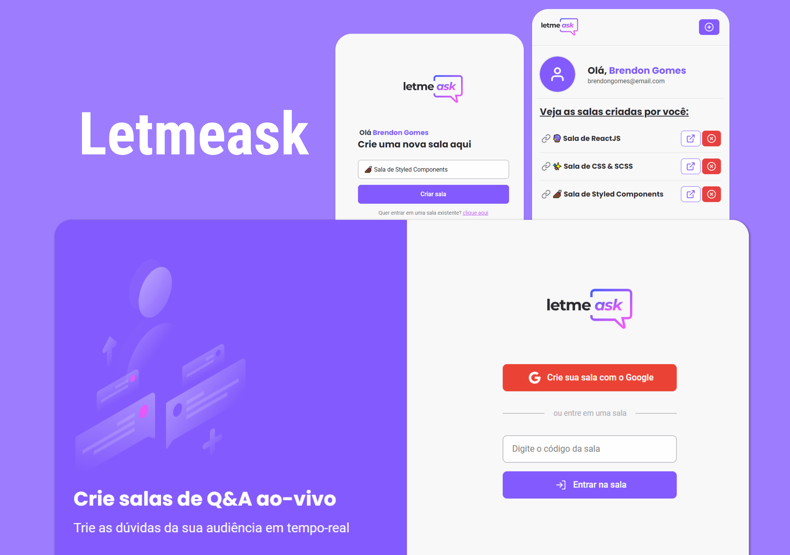

<h1 align="center">
    
</h1>

<p align="center">
    <a href="#-tecnologias">Tecnologias</a>&nbsp;&nbsp;|&nbsp;&nbsp;
    <a href="#-como-executar">Como executar</a>&nbsp;&nbsp;|&nbsp;&nbsp;
    <a href="#-projeto">Projeto</a>&nbsp;&nbsp;|&nbsp;&nbsp;
    <a href="#-layout">Layout</a>&nbsp;&nbsp;|&nbsp;&nbsp;
    <a href="#-features-extras">Features extras</a>&nbsp;&nbsp;|&nbsp;&nbsp;
    <a href="#-licença">Licença</a>
</p>

<p align="center">
    
</p>

<p align="center">
    
</p>

## 🛠 Tecnologias

Esse projeto foi desenvolvido com as seguintes tecnologias:

- [ReactJS](https://reactjs.org)
- [Firebase](https://firebase.google.com/)
- [TypeScript](https://www.typescriptlang.org/)

Utilitários

- [Google Fonts](https://fonts.google.com/)

## 🚀 Como executar

```bash

    # Clonar o repositório
    $ git clone https://github.com/Brendon3578/Letmeask

    # Entrar no diretório
    $ cd Letmeask
    
    # Instalar as dependências
    $ yarn install
    # ou
    $ npm run

    # Iniciar o projeto
    $ yarn start

```
Lembrando que será necessário criar uma conta no [Firebase](https://firebase.google.com/) e um projeto para disponibilizar um Realtime Database e fazer todas as configurações. Veja como configurar o seu Firebase detalhadamente [clicando aqui](https://github.com/Brendon3578/Letmeask/tree/master/.github/firebase). 

## 💻 Projeto

O projeto **Letmeask** é um app elaborado para criadores de conteúdos poderem criar salas de Q&amp;A com o seu público e poderem tirar dúvidas, de uma forma muito organizada e democrática. Criado a partir do evento **Next Level Week 6** dentro da trirla *React*JS.

- [Acesse o projeto](https://letmeask-aafe8.web.app/)

## 📷 Layout

O layout da aplicação está disponível no Figma:

[](https://www.figma.com/community/file/1009824839797878169/Letmeask)

## ☕ Features extras

<details>
  <summary><b>Front-end / Interface</b></summary>
  
  - :white_check_mark: Responsividade
  - :white_check_mark: Modais de confirmação para ações do usuário
  - :white_check_mark: Notificações Toasts para feedbacks
  - :white_check_mark: Tooltips
  - :white_check_mark: Adição do React-Icons para icones dinâmicos
  - :white_check_mark: Animação de loading
  - :white_check_mark: Ilustrações para quando não há questões/não há salas criadas por você
  - :white_large_square: Landing page para o projeto
  - :white_large_square: Utilização de styled components 💅🏾 para estilizações mais dinâmicas
  - :white_large_square: Darkmode

</details>

<details>
  <summary><b>Back-end / Funcionalidades</b></summary>
  
  - :white_check_mark: Usuário deletar a sua própria pergunta
  - :white_check_mark: Página de usuário para acessar as salas criadas por você
  - :white_check_mark: Página 404 quando a url não é reconhecida, ou quando a sala que está na url não existe
  - :white_check_mark: Opção de mudar o título da sala quando estiver na página de administrador
  - :white_check_mark: Verificação se usuário é admin da página (se estiver na página de admin)

</details>

<details>
  <summary><b>Database / Banco de dados</b></summary>
  
  - :white_check_mark: Pequenos ajustes no DB
  - :white_check_mark: Criação de uma nova tabela para ver as salas criadas pelo usuário, a vez de fazer todo o processo de iteração em todas as salas existentes no DB e verificar se o ID do criador da sala é o mesmo ID do usuário

</details>


## 📝 Licença

Esse projeto está sob a licença MIT. Veja o arquivo [LICENSE](.github/LICENSE.md) para mais detalhes.

---

<h3 align="center">
    Feito com ☕ por <a href="https://github.com/Brendon3578"> Brendon Gomes</a>
</h3>
